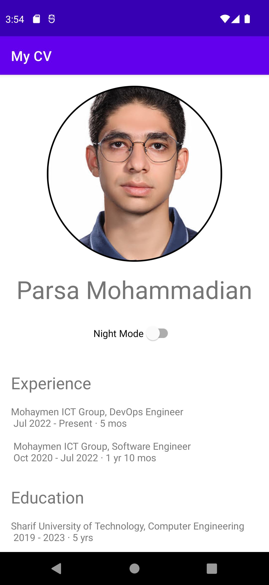
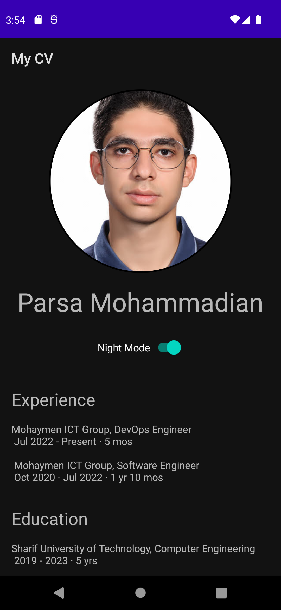
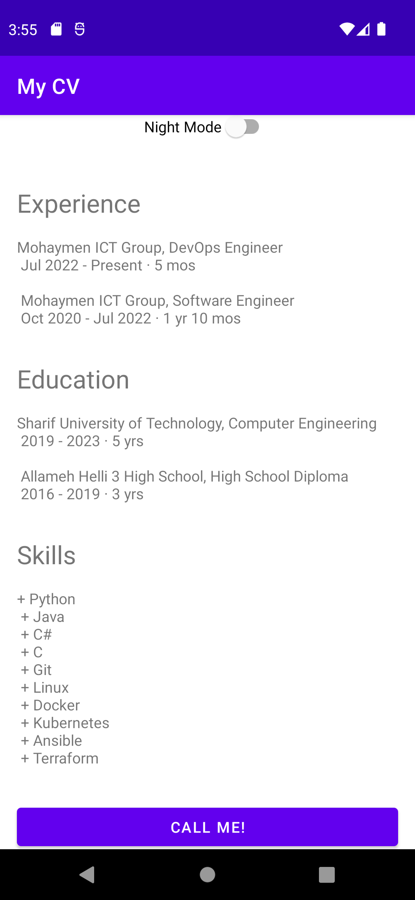
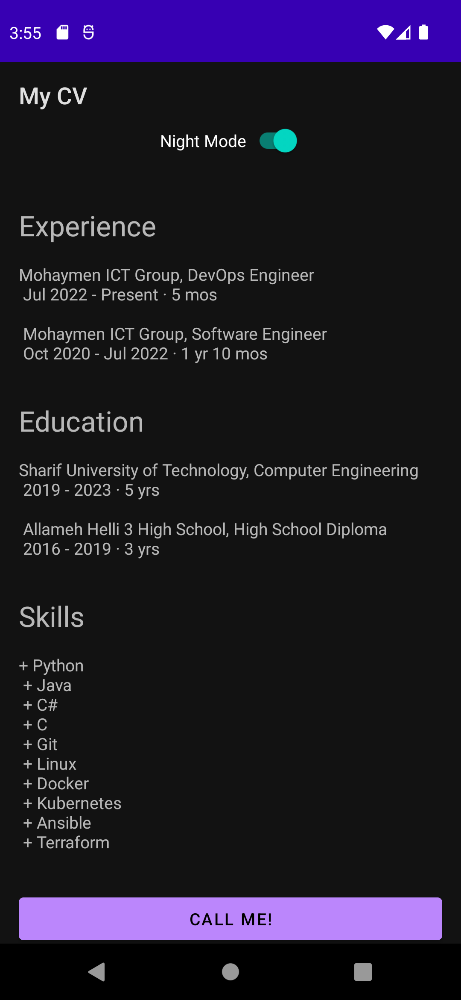

# mobile-homework-0

Mobile Programming Course Homework 0

Parsa Mohammadian - 98102284

Fall 2022

## Introduction
This is a simple android application that shows someones CV.
It consists of an image, name, three paragraphs with titles, and a button which calls CV's owner.
It also offers a dark mode!

## Customize Content
All the content is in the `src/main/res/values/strings.xml` file.
You can change the content of the application by changing the values of the strings.

In order to change the image, you can replace the `src/main/res/drawable/picture.png` file with your own image.

## Screenshots

Light Mode                               | Dark Mode
:---------------------------------------:|:---------------------------------------:
 | 
 | 
